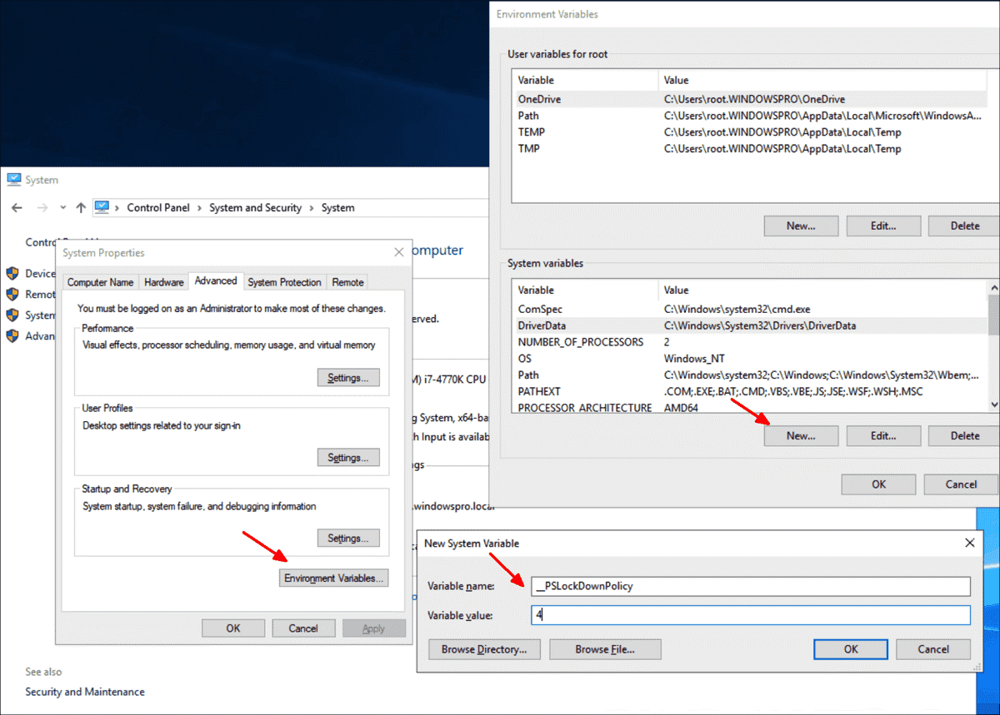
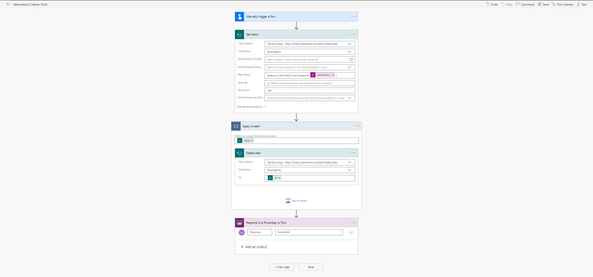

# Buro App Setup Manual

**Date: January 1, 2023**

**Version: 2.0**

**Author: Digital Transformation Service Sector**

## Summary

The Buro app allows employees to book seats for themselves and their colleagues in specific buildings during certain timeslots. This allows the department to ensure a safe environment with a much lower chance of employees coming into contact with each other. The app has been developed by the Digital Transformation Service Sector using the Office 365 Power Platform. The main pieces include a Power Apps application, a series of SharePoint lists that will store the data that is created and/or referenced by the application, and several Power Automate Flows for transferring information. This document provides the details for setting up this application to work in a different Office 365 environment or under a different tenant.

## SharePoint Lists and Content Setup

The solution uses PowerShell scripting and incorporates the SharePoint Patterns and Practices (PnP) library to populate the SharePoint environment. The first time you set up the SharePoint environment, you might first need to adjust your PowerShell environment, as described below.

### PowerShell and PnP Library Setup

1. Open a PowerShell window while logged in with an administrator account. This will require going to the folder that contains the executable for PowerShell (likely %SystemRoot%\system32\WindowsPowerShell\v1.0\), holding Control-Shift, and right-clicking to select &quot;Run as different user&quot;. Enter the administrator account credentials. Or, if you are already logged in as an administrator, you can just right-click and select &quot;Run as Administrator&quot;.
2. Run the command **Get-ExecutionPolicy**
3. If the current policy is not set to &quot;Unrestricted&quot;, run the command **Set-ExecutionPolicy Unrestricted**. \*\* Note: for safety, it is advised to switch the policy back to what it previously was, if it was previously not Unrestricted, after you are done with all of the required tasks in PowerShell.
4. Run this command to change the security protocol of your current session to TLS1.2: **[Net.ServicePointManager]::SecurityProtocol = [Net.SecurityProtocolType]::Tls12**
5. Install the PnP Library (if it has never been installed before) by running this command: **Install-Module SharePointPnPPowerShellOnline**
6. Run the command **$ExecutionContext.SessionState.LanguageMode**, to see if you are in Full language mode or constrained language mode.
7. If you are in constrained language mode, you will need to switch it to full by creating an environment variable called **\_PSLockDownPolicy** and giving it a value of 0, or changing its value to 0 if it already exists (if you are in constrained language mode, this variable likely has a value of 4). This can be done by observing the steps in this screenshot:

\*\* Note: for safety, it is advised to switch the policy back to constrained language mode (i.e. changing the variable back to 4) if it was previously set to that mode after you are done all of the required tasks in PowerShell.

### SharePoint List Templates Creation

1. Close any PowerShell window that may be open and open a new one as an administrator, as per Step 1 of the previous section.
2. Open file **Buro-ApplyListSchemas.ps1** and update the variables **$SiteURL** with your target SharePoint site and **$TemplateFile** with the full path and filename of the XML file that contains the List Template definitions.
3. Note that weird results may be expected if lists of the same name already exist on the SharePoint site. It is recommended to create a new, empty, SharePoint subsite for the lists that will be used by this app. To create a new subsite:
   - Select **Site contents** on the left-hand side of the SharePoint screen, **Site Settings** on the right, **Sites and workspaces** under "Site Administration", **Create**.
   - At minimum, provide a suitable **Title** and **Web Site Address**. The Template selection can be left as the default: Team site (no Office 365 group)
4. Run the command **./Buro-ApplyListSchemas** (note: you must be in the same directory as the script and the XML file when you run this.)
5. If you have not yet logged into Office 365 during this session, you will be prompted with a pop-up to log in to Office 365 in the usual way.
6. The new lists will then be created on the target SharePoint site.
7. If interested, refer to file **Buro-GetListSchemas.ps1** to see how the XML file was generated. This may come in handy if you wish to create a copy of the list templates on your site to migrate to a different environment.

### Populating SharePoint Lists

Two lists need to be pre-populated to begin using the app, **Timeslots** and **Translations**. To do so, perform the following steps:

1. Save the file **TimeslotsTempate.csv** and **TranslationsTempate.csv** in your working directory.
2. Open file **TimeslotsTemplate-ApplyListData.ps1** and update the variables **$SiteURL** with your target SharePoint site and **$CSVFile** with the full path to the TimeslotsTemplate CSV file and the file extension.
3. Run the command **./TimeslotsTemplate-ApplyListData**. The list will be populated on the target SharePoint site.
4. Open file **TranslationsTemplate-ApplyListData.ps1** and update the variables **$SiteURL** with your target SharePoint site and **$CSVFile** with the full path to the TranslationsTempate CSV file and the file extension.
5. Run the command **./TranslationsTemplate-ApplyListData**. The list will be populated on the target SharePoint site.

### Configuring Security Settings and User Access for SharePoint Site

The security of the lists needs to be set such that users have indirect write access to them (when creating a new reservation through the app, for example) but they should not be able to see or modify the lists directly. To achieve this goal, do the following:

1. Proceed to the top-level SharePoint private group (the level above any subsites).
2. At the top right, click the **Gear** (for **Settings**) --> **Site permissions** --> **Advanced permissions settings**.
3. The "Permissions" tab should now be selected near the top left. In the "Manage" portion of that menu, click **Permission Levels**.
4. Click **Add a Permission Level**.
5. Provide a name for the Permission Level (e.g. **Buro User**) and a description (e.g. **Users will only be able to add, update, and view items from a remote interface.**)
6. For the required permissions, select the following checkboxes:
   - **List Permissions**
     - Add Items
     - Edit Items
     - View Items
     - Open Items
   - **Site Permissions**
     - View Pages
     - Browse User Information
     - Use Remote Interfaces
     - Open
7. Create a SharePoint Group for the users of the app on the subsite containing the lists. First, proceed to the top-level SharePoint private group (the level above any subsites).
8. At the top right, click the **Gear** (for **Settings**) --> **Site permissions** --> **Advanced permissions settings**.
9. The "Permissions" tab should now be selected near the top left. In the "Grant" portion of that menu, click **Create Group**.
10. Provide a name for the group (e.g. **Buro Users Group**) and apply the following settings:
    - Group Settings - Who can view the membership of the group? **Group Members**
    - Group Settings - Who can edit the membership of the group? **Group Owner**
    - Membership Requests - Allow requests to join/leave this group? **No**
    - Membership Requests - Auto-accept requests? **No**
    - Give Group Permission to this Site - select the Permission Level that was created at step 5 (e.g. **Buro User**)
11. You should now see a list of all people who are members of the new group. It should only have the owner who created the list. Select **New** --> **Add Users**.
12. A popup will appear with the title "Share (name of Subsite)". Click **Show Options** and uncheck **Send an email invitation**, and enter **Everyone except external users** for the names. Then click **Share**.

### Configuring Edit Access to SharePoint Site

You may want certain users to have permission to access the lists directly and add or modify items of those lists. To achieve this goal, do the following:

1. Proceed to the top-level SharePoint private group (the level above any subsites).
2. At the top right, click the **Gear** (for **Settings**) --> **Site permissions** --> **Advanced permissions settings**.
3. The "Permissions" tab should now be selected near the top left. In the "Manage" portion of that menu, click **Permission Levels**.
4. Click **Add a Permission Level**.
5. Provide a name for the Permission Level (e.g. **Buro Data Entry User**) and a description (e.g. **Users will be able to add, update, and view items from the SharePoint interface.**)
6. For the required permissions, select the following checkboxes:
   - **List Permissions**
     - Manage Lists
     - Add Items
     - Edit Items
     - View Items
     - Open Items
     - View Application Pages
   - **Site Permissions**
     - Browse Directories
     - Use Self-Service Site Creation
     - View Pages
     - Browse User Information
     - Use Remote Interfaces
     - Use Client Integration Features
     - Open
     - Edit Personal User Information
     - Manage Personal Views
     - Add/Remove Personal Web Parts
     - Update Personal Web Parts
7. Create a SharePoint Group for the editors of the SharePoint lists. First, proceed to the top-level SharePoint private group (the level above any subsites).
8. At the top right, click the **Gear** (for **Settings**) --> **Site permissions** --> **Advanced permissions settings**.
9. The "Permissions" tab should now be selected near the top left. In the "Grant" portion of that menu, click **Create Group**.
10. Provide a name for the group (e.g. **Buro Data Entry Group**) and apply the following settings:
    - Group Settings - Who can view the membership of the group? **Group Members**
    - Group Settings - Who can edit the membership of the group? **Group Owner**
    - Membership Requests - Allow requests to join/leave this group? **No**
    - Membership Requests - Auto-accept requests? **No**
    - Give Group Permission to this Site - select the Permission Level that was created at step 5 (e.g. **Buro Data Entry User**)
11. You should now see a list of all people who are members of the new group. It should only have the owner who created the list. Select **New** --> **Add Users**.
12. A popup will appear with the title "Share (name of Subsite)". Click **Show Options** and uncheck **Send an email invitation**, and enter the email addresses for all the users for which you want to have this elevated permission role. Then click **Share**.

### Adding Additional Content to SharePoint

Certain content, specific to your organization, must be added to some lists in advance to take full advantage of the app’s functionality.

**Regions** - one row is required for each region you wish to use in the app. At least one region must be created for you to begin creating buildings.

**Buildings** - one row is required for each building you wish to use in the app. At least one building must be created for you to begin creating floors.

**Floors** - one row is required for each floor you wish to use in the app. At least one floor must be created for you to begin creating neighbourhoods.

**Neighbourhoods** - one row is required for each neighbourhood you wish to use in the app. At least one neighbourhood must be created for you to begin creating desks.

**SeatingArrangements** - one row is required for each seating arrangement you wish to use in the app. At least one seating arrangement must be created for you to begin creating desks. The _icon_link_ column is a link to the image file for that seating arrangement. Note. You can choose to store this image in the Documents folder on this SharePoint site or point to a publicly available link.

**SeatingType** - one row is required for each seating type you wish to use in the app. At least one seating type must be created for you to begin creating desks. The _seating_type_image_ column is a link to the image file for that seating type. Note. You can choose to store this image in the Documents folder on this SharePoint site or point to a publicly available link.

**Desks** - one row is required for each desk you wish to use in the app. All of the required fields are marked with a red \* when entering desks from the SharePoint "New Item" menu. The _desk_floor_plan_url_ and _desk_image_ columns are links to the image file for that desk. Note. You can choose to store these images in the Documents folder on this SharePoint site or point to a publicly available link.

**Timeslots** - there are three supported timeslots in the app: AM, PM, and All Day. By running the TimeslotsTemplate-ApplyListData.ps1 file in the [Populating SharePoint Lists step](#populating-sharepoint-lists) you have already populated the timeslots list and no further changes should be made to this list.

**Translations** - all of the translations needed for the app are populated into SharePoint by running the TranslationsTemplate-ApplyListData.ps1 file in the [Populating SharePoint Lists step](#populating-sharepoint-lists). If you plan on altering some of the text or adding new features, the translations needed for those can be added here.

**Users** - this list stores all of the users who have used Buro and their search preferences, if applicable. The _tester_ column is unchecked by default for all rows; however, developers or maintainers of this application may find it beneficial to check the _tester_ column for their User item in the SharePoint list.

### Info Regarding Number of Items in SharePoint Lists

It is important to note that SharePoint online has different behaviour when the number of items in a list exceeds 5000. This may in turn cause the app to experience odd behaviour or require troubleshooting. How soon a list approaches more than 5000 items depends on the number of employees using the app, but you can expect lists _Reservations_ and _Users_ to accumulate more than 5000 items over time. If you experience problems, one suggestion is to remove historical list items that are no longer required. To preserve the information before removing it from SharePoint, some options are:

- create Power Automate Flows to send list items to an on-prem location, using a Data Gateway, one-by-one, as they are created or modified in SharePoint. You may experience issues if you attempt to copy a large list in bulk in this fashion.
- use a PowerShell script to export list contents to a CSV file and load the contents into a database.
- use an ETL toolkit to transfer the data from SharePoint.

## Power Apps Setup

### Installation

1. Navigate to the main page for Power Apps. This can be accessed at [https://make.powerapps.com](https://make.powerapps.com/). You will need to log in with your Office 365 credentials if you have not already done so. Toggle to your desired environment at the top right of the window if required.
2. On the left-hand menu, click **Apps**.
3. At the top menu of the webpage, select **Import canvas app**.
4. Click **Upload**, navigate to the folder that contains the Power Apps ZIP file for the app (_Buro-PowerApps.zip_) and select it. It will upload. Once complete, click **Import**.
5. For **Review Package content**, if desired, select the wrench and change the app name to the desired name.
6. Select **Import**.

### Data Source Linkages

All data sources have been stripped from the app before sharing it. Several data sources will therefore need to be added to the app as follows:

1. On the main Apps page, click the … beside the imported app and click **Edit**.
2. On the editing page, on the left-hand side, click the cylinder to bring up the Data menu.
3. Click on **Add data** and expand the **Connectors** submenu.
4. Select **Office 365 Outlook** and then **Add a connection**. Then **Connect**.
5. Click on **Add data** and expand the **Connectors** submenu.
6. Select **Office 365 Users** and then **Add a connection**. Then **Connect**.
7. Click on **Add data** and expand the **Connectors** submenu.
8. Select **SharePoint** and then **Add a connection**. Ensure the radio button is on **Connect directly (cloud services)** and then click **Connect**. Enter the URL of the SharePoint site that contains all the lists you created, then click **Connect**. Select the lists that you previously created: _Buildings_, _Desks_, _ExternalErrors_, _Floors_, _Neighbourhoods_, _Regions_, _Reservations_, _SeatingArrangements_, _SeatingTypes_, _Timeslots_, _Translations_, _Users_; then click **Connect**.
9. Click on the save icon in the top right-hand area of PowerApps
10. Click on the publish icon in the top right-hand area of PowerApps

### Sharing the App

1. On the main Apps page, click the **…** beside the app and click **Share**.
2. Add users as desired, then click **Share**.

Note: The default permission given to users is the "User" permission. Alternatively, you can give certain users "Co-owner" access so they can use, edit, and share the app but not delete or change the app's owner.

### Rolling Back App Versions

1. On the main Apps page, click the **…** beside the imported app and click **Details**.
2. Select the **Versions** view.
3. From this view you will see which version of your app is live by the **Live** label in the Published column. Note: The **Live** label indicates which version of the app users will see when using the app. The person editing the app, on the other hand, will see the version listed at the top of the list when in the app's edit mode.
4. Select the **…** beside the version you wish to roll back to if it is not already Live.
5. Select **Restore**, then from the modal that opens, click **Restore**.
6. Notice that a new version was created and added to the top of the version list. This version does not have a Live label in the Published column. Note: Now, when you choose to edit the app, the version at the top of the list (the highest-numbered version) will be the one you are editing.

## Power Automate Flows Setup

There are two flows that need to be created for optimal functioning of the app:

- Reservations Cleaner Child
- Reservations Cleaner Parent

Let's begin by creating a solution to group these flows into:

1. Navigate to **Solutions**.
2. Click **New Solution**.
3. Name your solution, for example, "Buro Solution", and choose a publisher from the Publisher dropdown list.
4. Click **Create**.

To create the Reservations Cleaner Child flow, do the following:

1. From the solution view, click **New** -> **Automation** -> **Cloud flow** -> **Instant**.
2. Click **Skip**.
3. At the top left-hand side of the screen click on the **Untitled** text and paste the following text: Reservations Cleaner Child
4. On the flow builder pane under the **Triggers** section select the trigger called **Manually trigger a flow**.
5. Click **New step**.
6. Search for "Get items".
7. Under the **Actions** section select the trigger called **Get items**, the one for SharePoint.
8. Select **Show advanced options** and enter the following:
   - For the "Site Address" choose the SharePoint site that has the lists we created earlier.
   - For the "List Name" choose "Reservations".
   - For the "Filter Query", copy and paste in the following:
     `(status eq 'ON HOLD') and (Created le '@{addHours(utcNow(), -1)}')`
   - For the "Top Count" type in _100_.
9. Select the Get items button called **...** and choose **Settings**.
10. Turn on the "Pagination" option.
11. Set the "Threshold" to 100000.
12. Select **Done**.
13. Click **New step**.
14. Search for "Apply to each".
15. Under the **Actions** section select the action called **Apply to each**.
16. Click into the textbox called "Select item from previous step".
17. In the "Dynamic content" modal that appears, select the option called **value** under the "Get items" section.
18. Click on **Add an action**.
19. Seach for "Delete item".
20. Under the **Actions** section select the action called **Delete item**, the one for SharePoint.
21. Enter the following:
    - For the "Site Address" choose the SharePoint site that has the lists we created earlier.
    - For the "List Name" choose "Reservations".
    - For Id, click into the Id textbox.
      - In the "Dynamic content" modal that appears, select the option called **ID** under the "Get items" section.
22. Click **New step**.
23. Search for "Respond to a PowerApp or flow".
24. Under the **Actions** section select the trigger called **Respond to a PowerApp or flow**, the one for PowerApps.
25. Select **Add an output** and choose **Text**.
26. For the "Enter a title" textbox type in _Response_ and for the "Enter a value to correspond" textbox type in _Succeeded_.
27. Finally, click **Save**.
28. Your completed flow should resemble this:

29. In Microsft Flow, not your browser, click the back arrow.
30. You should be brought back to the solution you create.
31. Click on the **...** on the item called "Reservations Cleaner Child", then select **Details**.
32. In the "Run only users" section click **Edit**.
33. In the "Manage run-only permissions" pane that appears, under the "Connections Used" section change the dropdown from **Provided by run-only user** to **Use this connection (_YOUR EMAIL HERE_)**. Where **_YOUR EMAIL HERE_** is the email of the current user logged into Microsoft Flow.
34. A modal called "Connections Used" will appear. Click **Ok**.
35. Then, in the "Manage run-only permissions" pane, click **Save**.

To create the Reservations Cleaner Parent Flow, do the following:

1. From the solution you created earlier, click **New** -> **Automation** -> **Cloud flow** -> **Automated**.
2. Click **Skip**.
3. On the flow builder pane, search for "Recurrence".
4. Under the **Triggers** section choose Recurrence.
5. Set the Recurrence trigger to have the following properties:
   - Interval: 1
   - Frequency: Day
6. On the Recurrence trigger, click **Show advanced options**.
7. In the advanced options of the Recurrence trigger:

   - Select your timezone from the Timezone dropdown
   - Select "At these hours" to the hours of the day you'd like the flow to run. Note: We have it set to 17, so this flow will run at 17:00 or 5:00 PM

8. Click **New step**.
9. Search for "Run a Child Flow".
10. Under the **Actions** section select the action from the list called **Run a Child Flow**, the one for Flows.
11. On the "Run a Child Flow" action, open the "Child Flow" dropdown and select the flow called " Reservations Cleaner Child" that you created earlier.
12. At the top left-hand side of the screen click on the **Untitled** text and paste the following text: Reservations Cleaner Parent.
13. Your completed flow should resemble this (see below). Keep in mind that you can alter the time that this flow runs based on the needs of your organization.

14. Finally, click **Save**.
